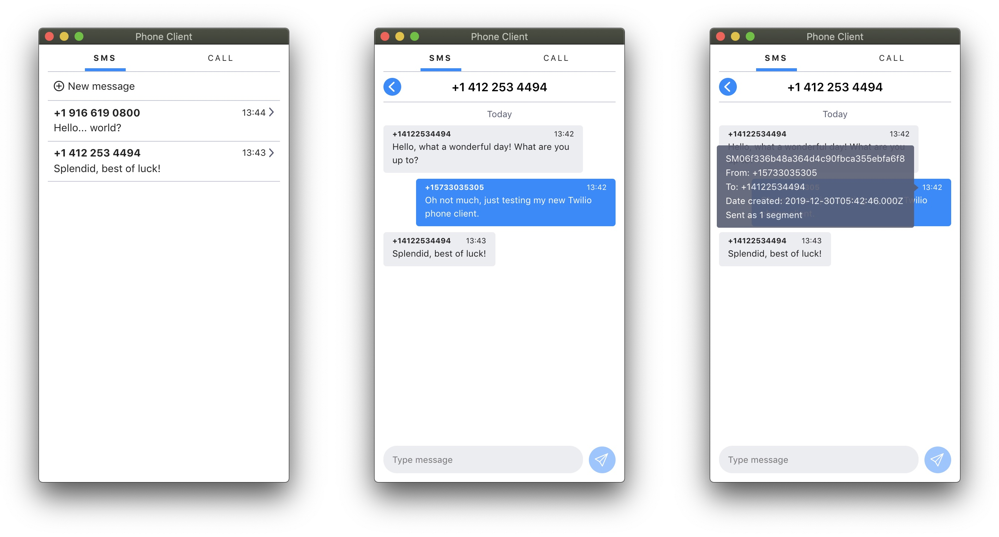

# Twilio Phone Client

- [Installation](./INSTALL.md)
- [Changelog](./CHANGELOG.md)

## Table of contents

- [Introduction](#introduction)
- [Features](#features)
- [Roadmap](#roadmap)
- [Screenshots](#screenshots)
  - [SMS](#sms)
  - [Call](#call)

## Introduction

This is a web client providing easy access to SMS and call capabilities of a Twilio phone number.

The SMS part is built on top of Twilio's [Programmable Chat API](https://www.twilio.com/docs/chat).

This repository consists of two parts:

```
/src/               # the frontend React app
/deploy/functions/  # supporting backend scripts, to be deployed as Twilio Functions
```

The npm `deploy` command utilizes [Twilio CLI](https://www.twilio.com/docs/twilio-cli/quickstart) to deploy both the frontend and backend to [Twilio Runtime](https://www.twilio.com/docs/runtime/functions-assets-api).

## Features

- SMS: Infitinty scolling (older messages get loaded automatically as one scrolls up in a thread)
- SMS: Hovering over message timestamp displays tooltip with additional details of each message including its [SID](https://www.twilio.com/docs/glossary/what-is-a-sid)
- SMS: Unread message count tracking
- Call: Support for both inbound and outbound calls
- Configurable accent color (see `REACT_APP_ACCENT_COLOR` in `/.env`)

## Roadmap

- ~~Add basic form of authentication~~
- Add one-click installation option (using Heroku) to eliminate the need for local env and numerous manual installation steps
- ~~Add support for inbound calls~~
- ~~Add unread badges to individual messaging threads and SMS channel overall~~
- ~~Add ability to delete SMS threads from within the client~~
- Add support for Multimedia Messages (MMS) for both inbound and outbound
- Add call history and allow quick redials

## Screenshots

### SMS



### Call


